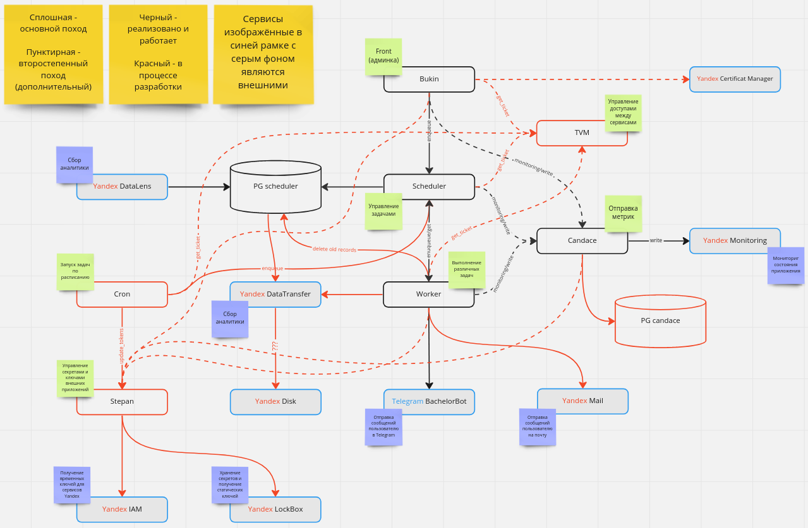

# bachelor

## Схема работы сервиса



Доска Miro: https://miro.com/app/board/uXjVMeAW6Vg=/?share_link_id=467955700272

## Про каждый микросервис

### Работающие

* [Bukin](https://github.com/DrunkBearEKB/bachelor/tree/add_base/src/bukin)
* [Scheduler](https://github.com/DrunkBearEKB/bachelor/tree/add_base/src/scheduler)
* [Worker](https://github.com/DrunkBearEKB/bachelor/tree/add_base/src/worker)
* [Candace](https://github.com/DrunkBearEKB/bachelor/tree/add_base/src/candace)

### В разарботке

* [TVM](https://github.com/DrunkBearEKB/bachelor/tree/add_base/src/tvm)
* [Cron](https://github.com/DrunkBearEKB/bachelor/tree/add_base/src/cron)
* [Stepan](https://github.com/DrunkBearEKB/bachelor/tree/add_base/src/stepan)

## Deploy

### Деплой и запуск

```shell
./deploy_from_machine.sh "<host>" "<user>"
```
где `<host>` - хост, на котором будет развернуто приложение, `<user>` - пользователь на удалённой машине.

### Посмотреть статус запущенных сервисов

#### Статус всех запущенных сервисов-служб
```shell
sudo systemctl list-units | grep bachelor
```

#### Статус одного сервиса-службы
```shell
sudo systemctl status <service>
```
где `<service>` - микросервис, логи которого Вы хотите посмотреть

#### Статус запуска сервиса-службы (может понадобиться если сервис не стартует)
```shell
sudo journalctl -u <service>
```
где `<service>` - микросервис, логи которого Вы хотите посмотреть

### Логи

```shell
less ./bachelor/logs/<service_name>.log
```
где `<service_name>` - имя микросервиса, логи которого Вы хотите посмотреть

## Автор

Иваненко Григорий, УрФУ, КН-404, 2023
